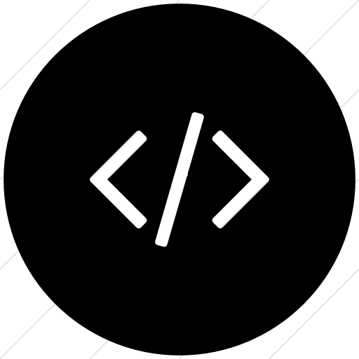

<p align="center">
  <a href="" rel="noopener">
 </a>
</p>

<h1 align="center">Developer Alley</h1>

<div align="center">

[](https://github.com/rgoshen/dev_alley)
[](https://github.com/rgoshen/dev_alley/issues)
[](https://github.com/rgoshen/dev_alley/pulls)
[](https://github.com/rgoshen/dev_alley/blob/main/LICENSE)

</div>

---

<p align="center"> It is a small social network app that includes authentication, profiles and forum posts using the MERN stack.
    <br> 
</p>

## 📝 Table of Contents

- [About](#about)
- [Getting Started](#getting_started)
- [Deployment](#deployment)
- [Usage](#usage)
- [Built Using](#built_using)
- [TODO](../TODO.md)-->
- [Authors](#authors)-->

## 🧐 About <a name = "about"></a>

A small social website for developers. This app allows developers to communicate, provide information and general share of knowledge. “Developer Alley”, is essentially a resource tool similar to other social apps such as "[Twitter](https://twitter.com/)". The purpose of this app is that it will provide access to information, resources and allow developer to network.

## 🏁 Getting Started <a name = "getting_started"></a>

These instructions will get you a copy of the project up and running on your local machine for development and testing purposes. See [deployment](#deployment) for notes on how to deploy the project on a live system.

### Prerequisites

What things you need to install the software and how to install them.

```
Give examples
```

### Installing

A step by step series of examples that tell you how to get a development env running.

Say what the step will be

```
Give the example
```

And repeat

```
until finished
```

End with an example of getting some data out of the system or using it for a little demo.

<!-- ## 🔧 Running the tests <a name = "tests"></a> -->

<!-- Explain how to run the automated tests for this system. -->

<!-- ### Break down into end to end tests -->

<!-- Explain what these tests test and why -->

<!-- ``` -->
<!-- Give an example -->
<!-- ``` -->

<!-- ### And coding style tests -->

<!-- Explain what these tests test and why -->

<!-- ``` -->
<!-- Give an example -->
<!-- ``` -->

## 🎈 Usage <a name="usage"></a>

### Demo


## 🚀 Deployment <a name = "deployment"></a>

Add additional notes about how to deploy this on a live system.

## ⛏️ Built Using <a name = "built_using"></a>

- [MongoDB](https://www.mongodb.com/) - Database
- [NodeJs](https://nodejs.org/en/) - Server Environment
- [Express](https://expressjs.com/) - Server Framework
- [ReactJs](https://reactjs.org/) - Web Framework

## ✍️ Author(s) <a name = "authors"></a>

- [@rgoshen](https://github.com/rgoshen) - Idea & Initial work
